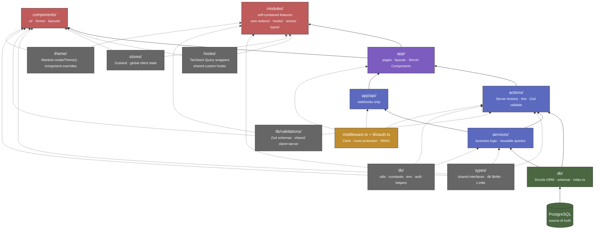

# Project Folder Architecture

> Layered folder dependency diagram. See [SKILL.md](SKILL.md) for the full coding standard.

## Legend

| Color | Layer | Can import from |
|-------|-------|-----------------|
| Green | **Data** — `db/` | Nothing (lowest) |
| Blue | **Server** — `services/`, `actions/`, `app/api/` | Data, Support |
| Purple | **Pages** — `app/` | Server, Support |
| Red | **UI** — `components/`, `modules/` | Pages (via props), Support |
| Gray | **Support** — `hooks/`, `stores/`, `types/`, `lib/`, `theme/` | Used across all layers |
| Gold | **Auth** — `middleware.ts`, `lib/auth.ts` | Spans all server layers |

## Key Rules

- **Arrows point UP** — lower layers never import from upper layers.
- `db/` is **server-only** — never imported in client components.
- `modules/` are self-contained — they have their own actions/, hooks/, stores/, types/ inside.
- `stores/` and `hooks/` support **component-level and above** — not used in services/ or db/.
- `types/` and `lib/validations/` are **shared everywhere** — client and server.
